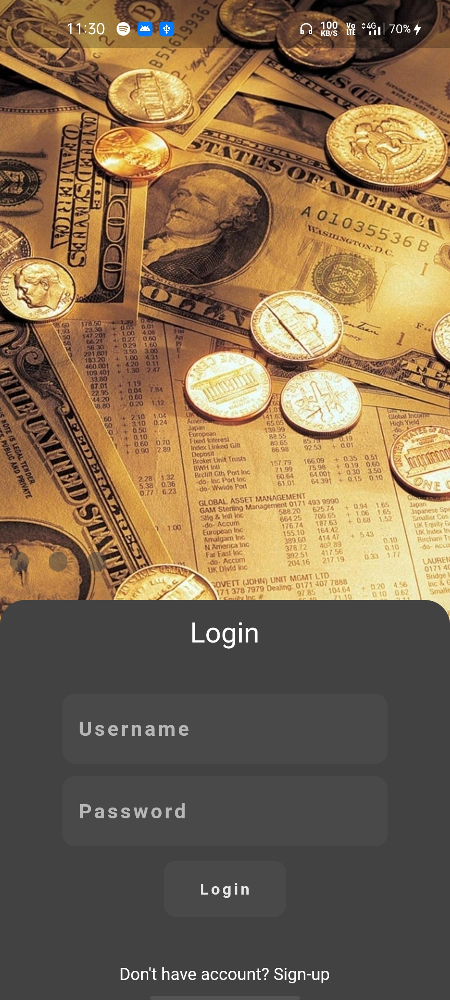
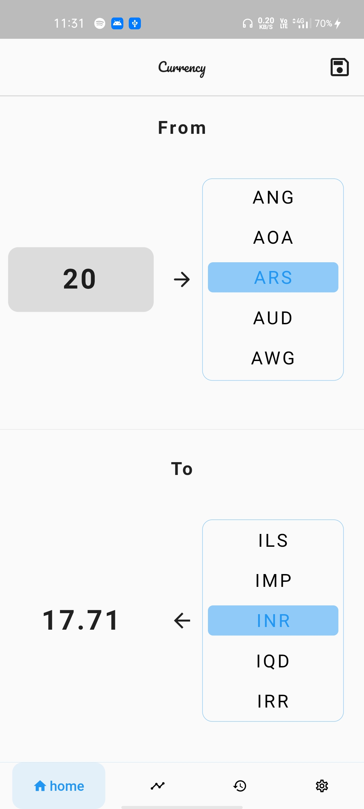
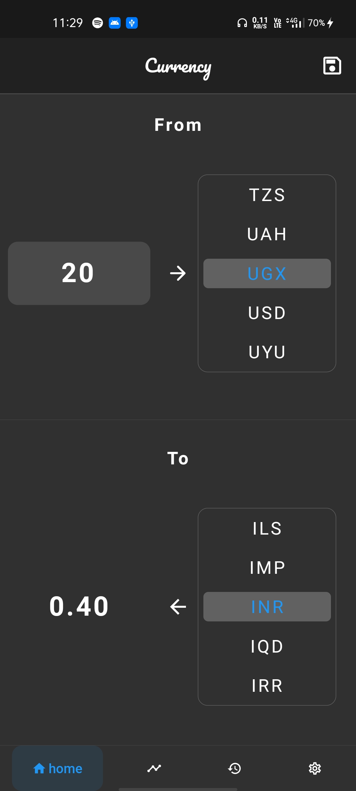
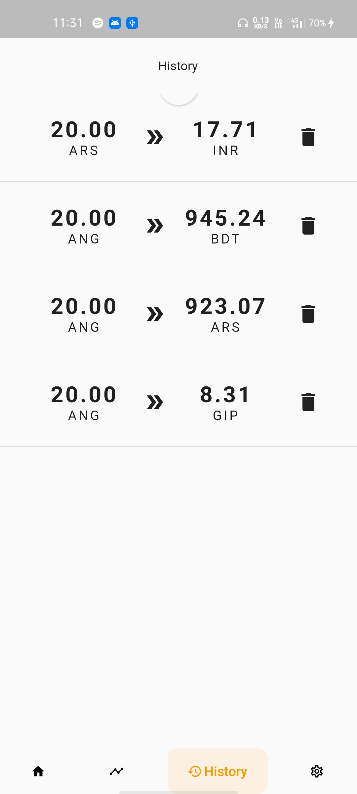
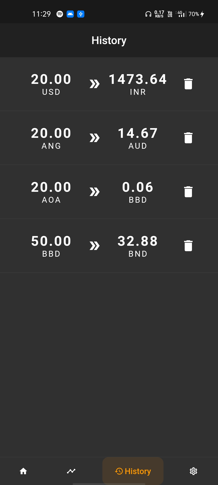

# currency

A Currency Conversion App build with Flutter

## Feature
1. sign-in, sign-up ui and build in SQLlite authentication
2. home page for converting one currency value to another
3. history for storing specific conversion
4. dark and light theme
5. offline capabilities
6. one Carousel

## ui
 
 
 
 

 
